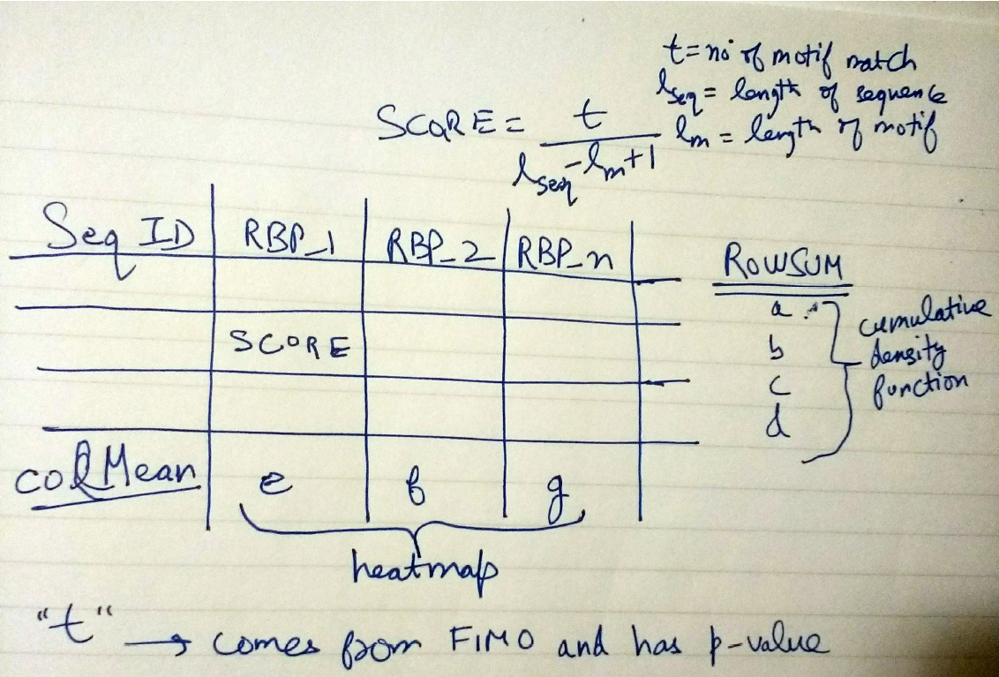
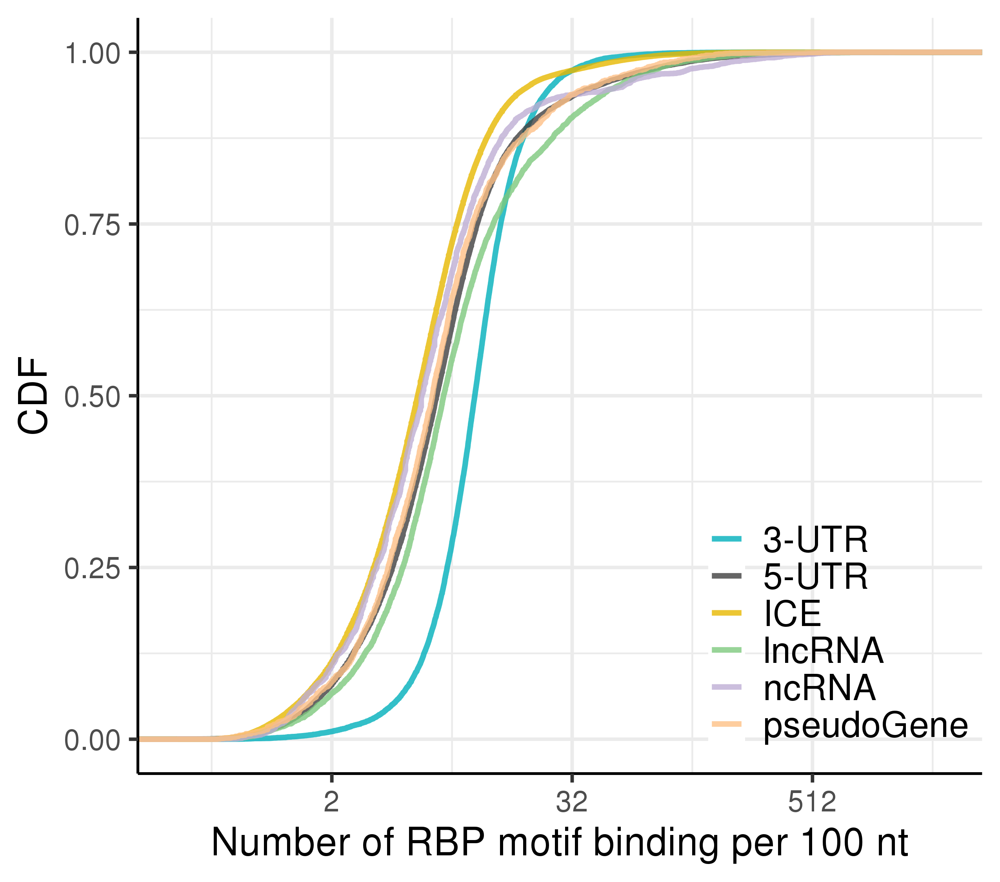
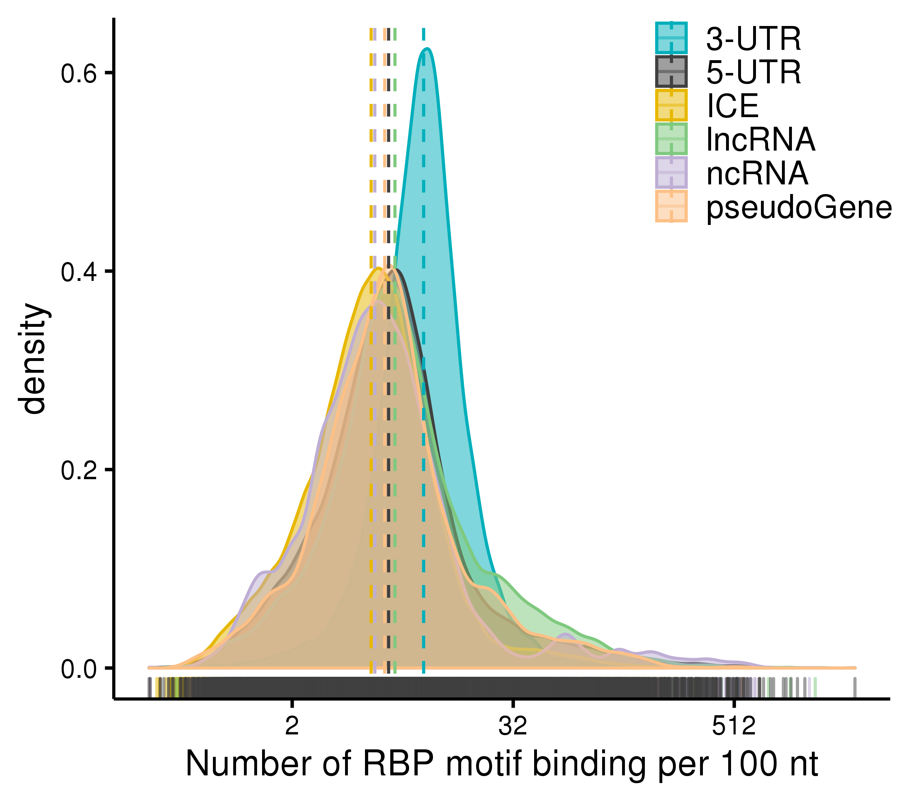

# RBP motif binding of ER predictions
Investigating binding of RBP motifs in a set of ER genomic regions

We used MEME suite for RBP motif analysis. It is a command-line program and a very popular tool for transcription factor binding site analysis. If you prefer to do everything in the R environment, you could try using the package "universalmotif" (http://bioconductor.org/packages/release/bioc/html/universalmotif.html). If you are new to the world of motif analysis, you may have a quick read of the vignettes of "universalmotif" - they are quite good!

## RBP database and setting up PWMs
We used the ATTRACT database (https://attract.cnic.es/index) which provides PWMs for RBP binding motifs. Many RBPs have multiple motifs which are highly similar. For this reason, we selected the longest motif for each RBP resulting in 84 unique RBP motifs. The following steps were performed to prepare the ATTRACT db data for analysis:

- [attract_db_filter_metaDataFile.R](attract_db_filter_metaDataFile.R): Filter database meta data file to extract data for human, motif length > 6, motif with highest quality score(1) and with longest length  

- [attract_db_filter_pwmFile.pl](attract_db_filter_pwmFile.pl)Filter database PWM file to extract PWMs for human

- Convert PWM file into meme format  
```
/meme/libexec/meme-5.1.1/chen2meme pwm_human.txt > pwm_human.meme
```  

## Scanning query regions with RBP motifs to calculate overall RBP binding density

This analysis was run indivdually on all set of sequences - all positive/negative, tissue-specific pos/neg, brain-specific pos/neg, shared pos/neg

### Running MEME
  
MEME requires query regions to be in FASTA format. We assigned an “id” to each of our region to put it in the fasta header.

- [get_fasta_er_predictions.R](get_fasta_er_predictions.R): code to extract FASTA sequence from Granges objects


MEME command:  
```
/meme/bin/fimo --bfile --uniform-- -oc <output_dir(will be created)> pwm_human.meme <query.fasta>
```  

### Summarising MEME results  

We summarised the FIMO results into a matrix where rows represented each sequence in our query set, and columns represented each RBP motif. The score for each motif was calculated as number of RBP motifs binding per 100 nt of query sequence.  
score = number of motif match/(sequence length/100)  

- [rbp_fimo_summarise.R](rbp_fimo_summarise.R): summarises total RBP score for each sequence (sum of all RBP motifs). 1st arg: fimo.tsv file ; 2nd arg: output file prefix; 3rd arg: p-value threshold (used 10e-4 for using all significant results from FIMO)  

Below is a description of the method. The score can also be calculated as below.
  

### Plotting results  

- [rbp_fimo_summary_plot.R](rbp_fimo_summary_plot.R): Uses the RBP summary results to plot density curves

Below are the results for RBP motif binding enrichment analysis in training regions:  
   
   

## Compare binding enrichment of RBPs between highly brain-specific (query) and shared 3’UTR predictions (control)

Finding RBP motifs enriched in a query set of sequences compared to control set (positive vs negative)  

MEME command:  
```
/meme/bin/ame --scoring avg --oc <output_dir> --control <control.fasta> <query.fasta> pwm_human.meme
```  
